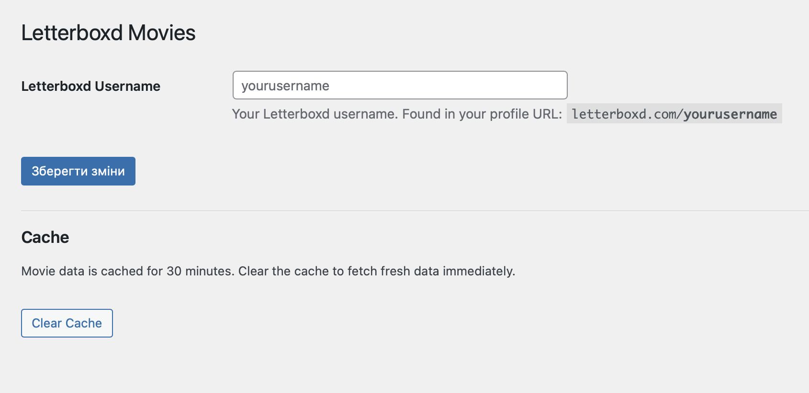

# Letterboxd Movies Block

A WordPress Gutenberg block that displays your recently watched [Letterboxd](https://letterboxd.com) movies, pulled live from your public RSS feed.



## Features

- Live server-side preview in the block editor
- Choose the number of grid columns (1–6)
- Choose how many recent films to display (1–20)
- Toggle poster image, title, and star rating independently
- Movie data cached for 30 minutes
- Cache can be cleared manually from the settings page

## Requirements

- WordPress 6.3+
- PHP 7.4+
- A public Letterboxd account

## Installation

1. Clone or download this repository into `wp-content/plugins/letterboxd-movies-block/`
2. Activate the plugin in **Plugins → Installed Plugins**
3. Go to **Settings → Letterboxd Movies** and enter your Letterboxd username
4. Insert the **Letterboxd Movies** block from the block inserter (Widgets category)

## Usage

Select the block in the editor and use the **Display Settings** panel in the sidebar to configure:

| Setting | Default | Description |
|---|---|---|
| Columns | 4 | Number of grid columns (1–6) |
| Number of movies | 4 | How many recent films to show (1–20) |
| Show poster | On | Display the movie poster image |
| Show title | On | Display the movie title |
| Show rating | Off | Display your star rating |

## Customisation

The block uses these CSS classes you can override in your theme:

```css
.lbm-grid    /* grid container */
.lbm-card    /* individual movie link */
.lbm-title   /* movie title */
.lbm-rating  /* star rating */
```

The rating colour uses `--wp--preset--color--accent` from your active theme, with an orange fallback.

## License

[GPL-2.0-or-later](LICENSE)
